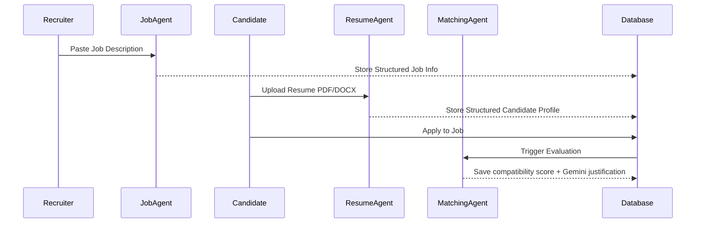

# Lumina Recruit Architecture

Lumina Recruit is a two-sided, AI-powered agentic recruitment platform built using Streamlit, SQLite, and the Google Gemini API.

## Directory Layout
- **`app.py`**: The application router controlling the page routing state.
- **`agents/`**: Contains specialized AI sub-agents:
  - `resume_agent.py`: Parses resumes into structural candidate JSON profiles.
  - `job_agent.py`: Parses job descriptions into structured requirement profiles.
  - `matching_agent.py`: Connects deterministic scores to Gemini match reports.
  - `recruiter_agent.py`: Conversation memory coordinator answering database status queries.
- **`services/`**: Code adapters for third-party operations:
  - `resume_service.py` / `job_service.py` / `matching_service.py`: Business logic layers.
  - `judge0_service.py`: Submits coding assessments to the Judge0 API compiler.
  - `notification_service.py`: Mock notification logging.
- **`database/`**: Persistent storage layer.
  - `db.py`: SQLite connectivity interface.
  - `models.py`: Handles schemas and questions seeding.
  - `repositories.py`: Safe data access routines.
- **`ui/`**: Page views and control states:
  - `landing.py` / `auth.py`: Onboarding and dual-authentication screens.
  - `student.py` / `recruiter.py` / `candidate_detail.py`: Dashboards and detailed review panels.

---

## Agent Collaboration flow

---

## Database Schemas (SQLite)

- **`users`**: Login credentials and role (`student` or `recruiter`).
- **`candidates`**: Hashed to `users.id`. Stores name, contact info, parsed work details, and original text.
- **`jobs`**: Extracted minimum requirements, salary ceilings, location constraints, and skills.
- **`applications`**: Linking table recording compatibility scores and status stages.
- **`assessments`**: Assignments for Aptitude and Technical coding sections.
- **`assessment_questions`**: Global question bank seeded on initialization.
- **`assessment_results`**: Detailed answer submissions and test-case results.
- **`messages`**: Log files recording recruiter-candidate conversations.
- **`interviews`**: Scheduled interview logs.
